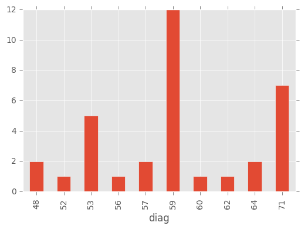

```python
# Import Libraries
from pandas import DataFrame, Series
import pandas as pd
import numpy as np
import matplotlib
import matplotlib.pyplot as plt
from plotly.offline import init_notebook_mode, iplot
import plotly.graph_objs as go
import plotly.offline as offline

%matplotlib inline
matplotlib.style.use('ggplot')
```


```python
# read in dataset
Neiss = pd.read_csv('NEISS2014.csv', parse_dates = True)
body_parts = pd.read_csv('BodyParts.csv')
diag = pd.read_csv('DiagnosisCodes.csv')
disp = pd.read_csv('disposition.csv')
```


```python
# Get an Overview of Neiss dataset.
Neiss[:3]
```


<div>
<table border="1" class="dataframe">
  <thead>
    <tr style="text-align: right;">
      <th></th>
      <th>CPSC Case #</th>
      <th>trmt_date</th>
      <th>psu</th>
      <th>weight</th>
      <th>stratum</th>
      <th>age</th>
      <th>sex</th>
      <th>race</th>
      <th>race_other</th>
      <th>diag</th>
      <th>diag_other</th>
      <th>body_part</th>
      <th>disposition</th>
      <th>location</th>
      <th>fmv</th>
      <th>prod1</th>
      <th>prod2</th>
      <th>narrative</th>
    </tr>
  </thead>
  <tbody>
    <tr>
      <th>0</th>
      <td>141200216</td>
      <td>10/23/2014</td>
      <td>63</td>
      <td>99.704</td>
      <td>M</td>
      <td>21</td>
      <td>Female</td>
      <td>None listed</td>
      <td>NaN</td>
      <td>62</td>
      <td>NaN</td>
      <td>75</td>
      <td>1</td>
      <td>1</td>
      <td>0</td>
      <td>679</td>
      <td>1807.0</td>
      <td>21YOF LAYING ON THE COUCH AND ROLLED OFF TO TH...</td>
    </tr>
    <tr>
      <th>1</th>
      <td>140117851</td>
      <td>1/4/2014</td>
      <td>63</td>
      <td>81.576</td>
      <td>M</td>
      <td>62</td>
      <td>Female</td>
      <td>White</td>
      <td>NaN</td>
      <td>57</td>
      <td>NaN</td>
      <td>79</td>
      <td>1</td>
      <td>1</td>
      <td>0</td>
      <td>1807</td>
      <td>115.0</td>
      <td>62YOF TRIPPED OVER THE CORD FOR THE VACUUM CLE...</td>
    </tr>
    <tr>
      <th>2</th>
      <td>150144993</td>
      <td>8/17/2014</td>
      <td>63</td>
      <td>99.704</td>
      <td>M</td>
      <td>21</td>
      <td>Female</td>
      <td>None listed</td>
      <td>NaN</td>
      <td>57</td>
      <td>NaN</td>
      <td>83</td>
      <td>1</td>
      <td>0</td>
      <td>0</td>
      <td>1333</td>
      <td>NaN</td>
      <td>21YOF FELL OFF A SKATEBOARD AND FRACTURED FOOT</td>
    </tr>
  </tbody>
</table>
</div>


```python
# Get an Overview of Neiss dataset.
Neiss.ix[0]
```


    CPSC Case #                                            141200216
    trmt_date                                             10/23/2014
    psu                                                           63
    weight                                                    99.704
    stratum                                                        M
    age                                                           21
    sex                                                       Female
    race                                                 None listed
    race_other                                                   NaN
    diag                                                          62
    diag_other                                                   NaN
    body_part                                                     75
    disposition                                                    1
    location                                                       1
    fmv                                                            0
    prod1                                                        679
    prod2                                                       1807
    narrative      21YOF LAYING ON THE COUCH AND ROLLED OFF TO TH...
    Name: 0, dtype: object


```python
# Prepare Bodyparts, Diagnosis and Disposition as dictionary that easy for future reference. 
body_parts_dict = dict(zip(body_parts.Code, body_parts.BodyPart))
diag_dict = dict(zip(diag.Code, diag.Diagnosis))
disp_dict = dict(zip(disp.Code, disp.Disposition))
```


```python
# Question 1-1: What are the top three body parts most frequently represented in this dataset?
Neiss.body_part.value_counts()[:3]
```


    75    9891
    76    5786
    92    5783
    Name: body_part, dtype: int64


```python
# Decode body parts
most_bp = [body_parts_dict[x] for x in Neiss.body_part.value_counts()[:3].index]
print ('The top three body parts most frequently represented are: %s' %most_bp)
```

    The top three body parts most frequently represented are: ['Head', 'Face', 'Finger']
    


```python
# Question 1-2:What are the top three body parts that are least frequently represented?
Neiss.body_part.value_counts()[-3:]
```


    87    390
    38    286
    84      4
    Name: body_part, dtype: int64


```python
# Decode body parts
least_bp = [body_parts_dict[x] for x in Neiss.body_part.value_counts()[-3:].index]
print ('The top three body parts that are least frequently represented are: %s' %least_bp)
```

    The top three body parts that are least frequently represented are: ['Not Recorded', 'Pubic region', '25-50% of body']
    


```python
# Question 2-1: How many injuries in this dataset involve a skateboard?
skateboard = Neiss[Neiss['narrative'].str.contains("SKATEBOARD")]
print ('The number of injuries in this dataset involve a skateboard is: %i' %len(skateboard))
```

    The number of injuries in this dataset involve a skateboard is: 466
    


```python
# Question 2-2: Of those injuries, what percentage were male and what percentage were female?
Female = (skateboard.groupby('sex').size()*100/len(skateboard)).ix['Female']
print("Female %.2f%%" % Female)
Male = (skateboard.groupby('sex').size()*100/len(skateboard)).ix['Male']
print("Male %.2f%%" % Male)
```

    Female 17.60%
    Male 82.40%
    


```python
# Question 2-3: What was the average age of someone injured in an incident involving a skateboard?
skateboard.age.describe()
```


    count    466.000000
    mean      17.991416
    std        9.087622
    min        3.000000
    25%       12.000000
    50%       16.000000
    75%       21.000000
    max       71.000000
    Name: age, dtype: float64


```python
'''NOTES: Since the minimum age is 3, which exclude for incidents that involve unknown age; and the maximun is 71, which exclude
injuries for baby less than 2 year old, we can conclude that none of the age here is out of ordinary. Thus, the average age of
someone injured in an accident involving a skateboard is about 18 years old. '''
```


    'NOTES: Since the minimum age is 3, which exclude for incidents that involve unknown age; and the maximun is 71, which exclude\ninjuries for baby less than 2 year old, we can conclude that none of the age here is out of ordinary. Thus, the average age of\nsomeone injured in an accident involving a skateboard is about 18 years old. '


```python
# Question3-1: What diagnosis had the highest hospitalization rate?(code 4)
disp_dict
```


    {1: 'Treated and released, or examined and released\n without treatment',
     2: 'Treated and transferred to another hospital',
     4: 'Treated and admitted for hospitalization (within same facility)',
     5: 'Held for observation (includes admitted for observation)',
     6: 'Left without being seen/Left against medical advice',
     8: 'Fatality, including DOA, died in the ED',
     9: 'Not Recorded'}


```python
disp_table = pd.crosstab(Neiss.diag, Neiss.disposition, normalize = 'index')
hhosp = disp_table.sort_values(by = [4], ascending = False)[:1]
```


```python
# Decode
print ('The diagnosis had the highest hospitalization rate is: %s' %diag_dict[69])
```

    The diagnosis had the highest hospitalization rate is: Submersion (including Drowning)
    


```python
# Question3-2: What diagnosis most often concluded with the individual leaving without being seen?
```


```python
# Question3-3: Briefly discuss your findings and any caveats you'd mention when discussing this data
```


```python
# Question 4: Visualize any existing relationship between age and reported injuries
age = Neiss['age'] 
age_over_2yr = age[(age>0) & (age<200)] # filter the one report that has unknown age
age_less_2yr = age[age > 200]
grouped_less_2yr = age_less_2yr.groupby(age).size()
grouped_over_2yr = age_over_2yr.groupby(age).size()

age_map = dict(zip(np.arange(201,224),(np.arange(-23,0))))
f = lambda x: age_map.get(x,x)
age = age.map(f)

grouped_less_2yr.index = grouped_less_2yr.index.map(f)
grouped_less_2yr.index.name = 'age'
```


```python
fig = plt.figure()
ax1 = fig.add_subplot(2,1,1)
grouped_over_2yr.plot()
plt.title('Older than 2')
ax2 = fig.add_subplot(2,1,2)
grouped_less_2yr.plot()
plt.title('Younger than 2')
plt.subplots_adjust(hspace=0.8)
```


```python
fig = plt.figure(figsize = (12,4))
ax = grouped_less_2yr.plot(label = 'Younger than 2-year-old', xticks = range(-23, 112, 5))
grouped_over_2yr.plot(ax=ax, label = 'Older than 2-year-old')
ax.legend()
label1 = list(range(2,107,5))
label2 = ['1Mo', '6Mo','11Mo','16Mo', '21Mo']
labels = label2 + label1
ax.set_xticklabels(labels, fontsize = 7)
```


    [<matplotlib.text.Text at 0x20950e5ac50>,
     <matplotlib.text.Text at 0x20950eb85f8>,
     <matplotlib.text.Text at 0x20950dff438>,
     <matplotlib.text.Text at 0x20951b80278>,
     <matplotlib.text.Text at 0x20951b800f0>,
     <matplotlib.text.Text at 0x20951b7e9b0>,
     <matplotlib.text.Text at 0x20950e15da0>,
     <matplotlib.text.Text at 0x20950e15320>,
     <matplotlib.text.Text at 0x20950e35a58>,
     <matplotlib.text.Text at 0x20950e27860>,
     <matplotlib.text.Text at 0x20950e27cf8>,
     <matplotlib.text.Text at 0x20951b73ba8>,
     <matplotlib.text.Text at 0x20951b03b38>,
     <matplotlib.text.Text at 0x20951b03a90>,
     <matplotlib.text.Text at 0x20951b17be0>,
     <matplotlib.text.Text at 0x20951af0860>,
     <matplotlib.text.Text at 0x20951af0668>,
     <matplotlib.text.Text at 0x20951b21cf8>,
     <matplotlib.text.Text at 0x20950e24048>,
     <matplotlib.text.Text at 0x20950e242e8>,
     <matplotlib.text.Text at 0x20951b42c50>,
     <matplotlib.text.Text at 0x20951244908>,
     <matplotlib.text.Text at 0x20951b336d8>,
     <matplotlib.text.Text at 0x20951b33240>,
     <matplotlib.text.Text at 0x20951b65ba8>,
     <matplotlib.text.Text at 0x20950d63828>]


```python
# Age and Number of Diag
age_diag = Neiss[['age', 'diag']]
fig, ax = plt.subplots()
ax.scatter(age_diag.age, age_diag.diag)

age_diag_less_2 = age_diag[age_diag.age > 200]
age_diag_over_2 = age_diag[(age_diag.age < 200) & (age_diag.age > 0)]
```


```python
# the random data
from matplotlib.ticker import NullFormatter
x = age_diag_less_2.diag
y = age_diag_less_2.age

nullfmt = NullFormatter()  

left, width = 0.1, 0.65
bottom, height = 0.1, 0.65
bottom_h = left + width + 0.02

rect_scatter = [left, bottom, width, height]
rect_histx = [left, bottom_h, width, 0.2]

# start with a rectangular Figure
plt.figure(1, figsize=(8, 8))

axScatter = plt.axes(rect_scatter)
axHistx = plt.axes(rect_histx)

# no labels
axHistx.xaxis.set_major_formatter(nullfmt)
# the scatter plot:
axScatter.scatter(x, y)

# now determine nice limits by hand:
binwidth = 1

axScatter.set_xlim((40, 75))
axScatter.set_ylim((200, 225))
labels = ['0', '5Mo', '10Mo', '15Mo','20Mo','25Mo']
axScatter.set_yticklabels(labels)


bins = np.arange(40, 75 + binwidth, binwidth)

axHistx.hist(x, bins=bins)

axHistx.set_xlim(axScatter.get_xlim())
```


    (40.0, 75.0)


```python
# the random data
x = age_diag_over_2.diag
y = age_diag_over_2.age

nullfmt = NullFormatter()  

# definitions for the axes
left, width = 0.1, 0.65
bottom, height = 0.1, 0.65
bottom_h = left_h = left + width + 0.02

rect_scatter = [left, bottom, width, height]
rect_histx = [left, bottom_h, width, 0.2]

# start with a rectangular Figure
plt.figure(1, figsize=(8, 8))

axScatter = plt.axes(rect_scatter)
axHistx = plt.axes(rect_histx)

# no labels
axHistx.xaxis.set_major_formatter(nullfmt)

# the scatter plot:
axScatter.scatter(x, y)

# now determine nice limits by hand:
binwidth = 1

axScatter.set_xlim((40, 75))
axScatter.set_ylim((0, 120))

bins = np.arange(40, 75 + binwidth, binwidth)

axHistx.hist(x, bins=bins)

axHistx.set_xlim(axScatter.get_xlim())
```


```python
# Age and Product
age_prod1 = Neiss[['age','prod1']]
age_prod2 = Neiss[['age','prod2']]
age_prod1.rename(columns = {'prod1': 'prod'}, inplace = True)
age_prod2.rename(columns = {'prod2': 'prod'}, inplace = True)
age_prod = age_prod1.append(age_prod1)
```

    C:\Users\Crystal\Anaconda3\lib\site-packages\pandas\core\frame.py:2754: SettingWithCopyWarning: 
    A value is trying to be set on a copy of a slice from a DataFrame
    
    See the caveats in the documentation: http://pandas.pydata.org/pandas-docs/stable/indexing.html#indexing-view-versus-copy
      **kwargs)
    


    age
    0    5040
    2    4076
    3    4076
    4    4076
    5    1244
    dtype: int64


```python
age_prod_over2 = age_prod[age_prod.age<200]
age_prod_less2 = age_prod[age_prod.age>200]
```


```python
size_over2 = age_prod_over2.groupby(['age','prod']).size()
size_over2 = size_over2.unstack().idxmax(axis = 1)
```


```python
size_less2 = age_prod_less2.groupby(['age','prod']).size()
size_less2 = size_less2.unstack().idxmax(axis = 1)

age_map2 = dict(zip(np.arange(201,224),(np.arange(1,24).astype('str'))))
for k in age_map2:
    age_map2[k] = age_map2[k] + 'Mo'

size_less2.index = age_map2.values()
```


```python
init_notebook_mode(connected=True)
trace = go.Scatter(
    x = size_over2,
    y = size_over2.index,
    mode = 'markers'
)
data = [trace]
offline.iplot({'data': data,
               'layout': {'title': 'Age against Product',
                          'font': dict(size=16)}},
             image='png')
```


<script>requirejs.config({paths: { 'plotly': ['https://cdn.plot.ly/plotly-latest.min']},});if(!window.Plotly) {{require(['plotly'],function(plotly) {window.Plotly=plotly;});}}</script>


<div id="ae11372f-079a-451d-afb8-755fd02e5b59" style="height: 525px; width: 100%;" class="plotly-graph-div"></div><script type="text/javascript">require(["plotly"], function(Plotly) { window.PLOTLYENV=window.PLOTLYENV || {};window.PLOTLYENV.BASE_URL="https://plot.ly";Plotly.newPlot("ae11372f-079a-451d-afb8-755fd02e5b59", [{"type": "scatter", "mode": "markers", "y": [0, 2, 3, 4, 5, 6, 7, 8, 9, 10, 11, 12, 13, 14, 15, 16, 17, 18, 19, 20, 21, 22, 23, 24, 25, 26, 27, 28, 29, 30, 31, 32, 33, 34, 35, 36, 37, 38, 39, 40, 41, 42, 43, 44, 45, 46, 47, 48, 49, 50, 51, 52, 53, 54, 55, 56, 57, 58, 59, 60, 61, 62, 63, 64, 65, 66, 67, 68, 69, 70, 71, 72, 73, 74, 75, 76, 77, 78, 79, 80, 81, 82, 83, 84, 85, 86, 87, 88, 89, 90, 91, 92, 93, 94, 95, 96, 97, 98, 99, 100, 101, 102, 103, 105], "x": [5040, 4076, 4076, 4076, 1244, 1244, 5040, 5040, 5040, 5040, 1211, 1205, 1211, 1205, 1205, 1205, 1205, 1205, 1205, 1842, 1842, 1842, 1842, 1842, 1842, 1842, 1842, 1842, 1842, 1842, 1842, 1842, 1842, 1842, 1842, 1842, 1842, 1842, 1842, 1842, 1842, 1842, 1842, 1842, 1842, 1842, 1842, 1842, 1842, 1842, 1842, 1842, 1842, 1842, 1842, 1842, 1842, 1842, 1842, 1807, 1807, 1807, 1807, 1842, 1807, 1807, 1807, 1807, 1807, 1807, 1807, 1807, 1807, 1807, 1807, 1807, 1807, 1807, 1807, 1807, 1807, 1807, 1807, 1807, 1807, 1807, 1807, 1807, 1807, 1807, 1807, 1807, 1807, 1807, 1807, 1807, 1807, 1807, 1807, 1807, 1807, 1807, 611, 1807]}], {"title": "Age against Product", "font": {"size": 16}}, {"showLink": true, "linkText": "Export to plot.ly"})});</script>


<script>function downloadimage(format, height, width, filename) {var p = document.getElementById('ae11372f-079a-451d-afb8-755fd02e5b59');Plotly.downloadImage(p, {format: format, height: height, width: width, filename: filename});};if(document.readyState == 'complete') {{downloadimage('png', 600, 800, 'plot_image');}}</script>


```python
init_notebook_mode(connected=True)
trace = go.Scatter(
    x = size_less2,
    y = size_less2.index,
    mode = 'markers'
)
data = [trace]
offline.iplot({'data': data,
               'layout': {'title': 'Age against Product',
                          'font': dict(size=16)}},
             image='png')
```


<script>requirejs.config({paths: { 'plotly': ['https://cdn.plot.ly/plotly-latest.min']},});if(!window.Plotly) {{require(['plotly'],function(plotly) {window.Plotly=plotly;});}}</script>


<div id="7da956b7-cf55-4538-b34b-99d4df7a2c06" style="height: 525px; width: 100%;" class="plotly-graph-div"></div><script type="text/javascript">require(["plotly"], function(Plotly) { window.PLOTLYENV=window.PLOTLYENV || {};window.PLOTLYENV.BASE_URL="https://plot.ly";Plotly.newPlot("7da956b7-cf55-4538-b34b-99d4df7a2c06", [{"type": "scatter", "mode": "markers", "y": ["1Mo", "2Mo", "3Mo", "4Mo", "5Mo", "6Mo", "7Mo", "8Mo", "9Mo", "10Mo", "11Mo", "12Mo", "13Mo", "14Mo", "15Mo", "16Mo", "17Mo", "18Mo", "19Mo", "20Mo", "21Mo", "22Mo", "23Mo"], "x": [4076, 1807, 4076, 679, 4076, 4076, 4076, 4076, 4076, 4076, 4076, 4076, 4057, 4057, 1842, 4076, 1842, 1842, 1842, 1842, 1842, 4057, 4076]}], {"title": "Age against Product", "font": {"size": 16}}, {"showLink": true, "linkText": "Export to plot.ly"})});</script>


<script>function downloadimage(format, height, width, filename) {var p = document.getElementById('7da956b7-cf55-4538-b34b-99d4df7a2c06');Plotly.downloadImage(p, {format: format, height: height, width: width, filename: filename});};if(document.readyState == 'complete') {{downloadimage('png', 600, 800, 'plot_image');}}</script>


```python
'''
Question 5+ (OPTOINAL)
Investigate the data however you like and discuss any interesting insights you can find in the data
(Don’t feel pressured to spend hours on this)
'''
```


```python
# Question5: What should I watch out for? How are people in my demographics are getting injured? 
demo = Neiss[(Neiss.age>19) & (Neiss.age<31) & (Neiss.sex == 'Female') & (Neiss.race == 'Asian')]
demo
```


<div>
<table border="1" class="dataframe">
  <thead>
    <tr style="text-align: right;">
      <th></th>
      <th>CPSC Case #</th>
      <th>trmt_date</th>
      <th>psu</th>
      <th>weight</th>
      <th>stratum</th>
      <th>age</th>
      <th>sex</th>
      <th>race</th>
      <th>race_other</th>
      <th>diag</th>
      <th>diag_other</th>
      <th>body_part</th>
      <th>disposition</th>
      <th>location</th>
      <th>fmv</th>
      <th>prod1</th>
      <th>prod2</th>
      <th>narrative</th>
    </tr>
  </thead>
  <tbody>
    <tr>
      <th>1612</th>
      <td>140432618</td>
      <td>4/3/2014</td>
      <td>93</td>
      <td>14.3089</td>
      <td>V</td>
      <td>30</td>
      <td>Female</td>
      <td>Asian</td>
      <td>NaN</td>
      <td>56</td>
      <td>NaN</td>
      <td>92</td>
      <td>1</td>
      <td>1</td>
      <td>0</td>
      <td>1616</td>
      <td>NaN</td>
      <td>30 YOF HAS BEEN UNABLE TO REMOVE WEDDING RING....</td>
    </tr>
    <tr>
      <th>4141</th>
      <td>140237020</td>
      <td>2/10/2014</td>
      <td>34</td>
      <td>14.3089</td>
      <td>V</td>
      <td>22</td>
      <td>Female</td>
      <td>Asian</td>
      <td>NaN</td>
      <td>48</td>
      <td>NaN</td>
      <td>81</td>
      <td>1</td>
      <td>1</td>
      <td>0</td>
      <td>1934</td>
      <td>NaN</td>
      <td>22 YF WAS BOILING HOT WATER AND IT FELL ON HER...</td>
    </tr>
    <tr>
      <th>4158</th>
      <td>140237123</td>
      <td>2/13/2014</td>
      <td>34</td>
      <td>14.3089</td>
      <td>V</td>
      <td>26</td>
      <td>Female</td>
      <td>Asian</td>
      <td>NaN</td>
      <td>59</td>
      <td>NaN</td>
      <td>92</td>
      <td>1</td>
      <td>0</td>
      <td>0</td>
      <td>1112</td>
      <td>NaN</td>
      <td>26 YF CUT HER FINGER ON AN ALUMINUM CAN. DX FI...</td>
    </tr>
    <tr>
      <th>7245</th>
      <td>140236909</td>
      <td>2/15/2014</td>
      <td>79</td>
      <td>80.0213</td>
      <td>S</td>
      <td>22</td>
      <td>Female</td>
      <td>Asian</td>
      <td>NaN</td>
      <td>57</td>
      <td>NaN</td>
      <td>32</td>
      <td>1</td>
      <td>9</td>
      <td>0</td>
      <td>3255</td>
      <td>NaN</td>
      <td>22YOF WAS ICE SKATING FELL INJURED ELBOW ...FX...</td>
    </tr>
    <tr>
      <th>13290</th>
      <td>141030841</td>
      <td>10/8/2014</td>
      <td>34</td>
      <td>15.6716</td>
      <td>V</td>
      <td>30</td>
      <td>Female</td>
      <td>Asian</td>
      <td>NaN</td>
      <td>62</td>
      <td>NaN</td>
      <td>75</td>
      <td>1</td>
      <td>4</td>
      <td>0</td>
      <td>5040</td>
      <td>NaN</td>
      <td>30 YF WAS INVOLVED IN A HEAD ON COLLISION WITH...</td>
    </tr>
    <tr>
      <th>13333</th>
      <td>140425823</td>
      <td>4/5/2014</td>
      <td>34</td>
      <td>14.3089</td>
      <td>V</td>
      <td>21</td>
      <td>Female</td>
      <td>Asian</td>
      <td>NaN</td>
      <td>64</td>
      <td>NaN</td>
      <td>35</td>
      <td>1</td>
      <td>9</td>
      <td>0</td>
      <td>3278</td>
      <td>NaN</td>
      <td>21 Y FEMALE REPORTS INJURING KNEE DURING DANCE...</td>
    </tr>
    <tr>
      <th>18227</th>
      <td>140666408</td>
      <td>6/26/2014</td>
      <td>30</td>
      <td>89.7336</td>
      <td>M</td>
      <td>30</td>
      <td>Female</td>
      <td>Asian</td>
      <td>NaN</td>
      <td>71</td>
      <td>CELLULITIS</td>
      <td>94</td>
      <td>1</td>
      <td>0</td>
      <td>0</td>
      <td>1616</td>
      <td>NaN</td>
      <td>30YOF HAS REDNESS OF EARS FROM WEARING NEW EAR...</td>
    </tr>
    <tr>
      <th>22278</th>
      <td>140146272</td>
      <td>1/16/2014</td>
      <td>34</td>
      <td>14.3089</td>
      <td>V</td>
      <td>23</td>
      <td>Female</td>
      <td>Asian</td>
      <td>NaN</td>
      <td>71</td>
      <td>ANIMAL BITE</td>
      <td>92</td>
      <td>6</td>
      <td>0</td>
      <td>0</td>
      <td>1141</td>
      <td>NaN</td>
      <td>23 YF WAS TAPING A BOX THAT A SQUIRREL WENT IN...</td>
    </tr>
    <tr>
      <th>22287</th>
      <td>140732202</td>
      <td>7/5/2014</td>
      <td>34</td>
      <td>15.6716</td>
      <td>V</td>
      <td>27</td>
      <td>Female</td>
      <td>Asian</td>
      <td>NaN</td>
      <td>53</td>
      <td>NaN</td>
      <td>79</td>
      <td>1</td>
      <td>9</td>
      <td>0</td>
      <td>1842</td>
      <td>NaN</td>
      <td>27 YF HAD A MECHANICAL FALL UP CONCRETE STEPS ...</td>
    </tr>
    <tr>
      <th>25605</th>
      <td>140508283</td>
      <td>1/27/2014</td>
      <td>40</td>
      <td>14.3089</td>
      <td>V</td>
      <td>26</td>
      <td>Female</td>
      <td>Asian</td>
      <td>NaN</td>
      <td>71</td>
      <td>CARTILAGE INJURY</td>
      <td>35</td>
      <td>1</td>
      <td>0</td>
      <td>0</td>
      <td>3278</td>
      <td>NaN</td>
      <td>26YOF C/O PAIN &amp; SWELLING TO HER LT KNEE, WAS ...</td>
    </tr>
    <tr>
      <th>25957</th>
      <td>140639941</td>
      <td>6/10/2014</td>
      <td>35</td>
      <td>14.3089</td>
      <td>V</td>
      <td>22</td>
      <td>Female</td>
      <td>Asian</td>
      <td>NaN</td>
      <td>71</td>
      <td>ABSCESS</td>
      <td>80</td>
      <td>1</td>
      <td>0</td>
      <td>0</td>
      <td>1661</td>
      <td>NaN</td>
      <td>22YOF HAS ABSCESS UNDER ARM AFTER SHAVING ABSC...</td>
    </tr>
    <tr>
      <th>26640</th>
      <td>141215975</td>
      <td>11/30/2014</td>
      <td>34</td>
      <td>15.6716</td>
      <td>V</td>
      <td>20</td>
      <td>Female</td>
      <td>Asian</td>
      <td>NaN</td>
      <td>59</td>
      <td>NaN</td>
      <td>35</td>
      <td>1</td>
      <td>1</td>
      <td>0</td>
      <td>611</td>
      <td>NaN</td>
      <td>20 YF WAS CLEANING THE BATHTUB AND CUT KNEE. D...</td>
    </tr>
    <tr>
      <th>26643</th>
      <td>141038572</td>
      <td>10/11/2014</td>
      <td>34</td>
      <td>15.6716</td>
      <td>V</td>
      <td>24</td>
      <td>Female</td>
      <td>Asian</td>
      <td>NaN</td>
      <td>53</td>
      <td>NaN</td>
      <td>76</td>
      <td>1</td>
      <td>1</td>
      <td>0</td>
      <td>679</td>
      <td>NaN</td>
      <td>24 Y FEMALE FELL STRIKING FACE ON ARM OF SOFA ...</td>
    </tr>
    <tr>
      <th>26646</th>
      <td>140940910</td>
      <td>9/9/2014</td>
      <td>34</td>
      <td>15.6716</td>
      <td>V</td>
      <td>25</td>
      <td>Female</td>
      <td>Asian</td>
      <td>NaN</td>
      <td>59</td>
      <td>NaN</td>
      <td>75</td>
      <td>5</td>
      <td>1</td>
      <td>0</td>
      <td>1807</td>
      <td>NaN</td>
      <td>25 YF WAS CLEANING BATHROOM AND FELT WEAK AND ...</td>
    </tr>
    <tr>
      <th>29667</th>
      <td>140522268</td>
      <td>4/30/2014</td>
      <td>51</td>
      <td>74.3851</td>
      <td>L</td>
      <td>28</td>
      <td>Female</td>
      <td>Asian</td>
      <td>NaN</td>
      <td>52</td>
      <td>NaN</td>
      <td>75</td>
      <td>5</td>
      <td>8</td>
      <td>0</td>
      <td>1807</td>
      <td>NaN</td>
      <td>28 YO F,PT STATES SHE SLIPPED,FELL,LANDED ON B...</td>
    </tr>
    <tr>
      <th>30976</th>
      <td>140704887</td>
      <td>6/26/2014</td>
      <td>34</td>
      <td>14.3089</td>
      <td>V</td>
      <td>20</td>
      <td>Female</td>
      <td>Asian</td>
      <td>NaN</td>
      <td>53</td>
      <td>NaN</td>
      <td>81</td>
      <td>1</td>
      <td>4</td>
      <td>0</td>
      <td>5040</td>
      <td>NaN</td>
      <td>20 Y FEMALE RIDING BIKE , HIT BY CAR CAUSING I...</td>
    </tr>
    <tr>
      <th>31016</th>
      <td>141026998</td>
      <td>10/5/2014</td>
      <td>34</td>
      <td>15.6716</td>
      <td>V</td>
      <td>21</td>
      <td>Female</td>
      <td>Asian</td>
      <td>NaN</td>
      <td>59</td>
      <td>NaN</td>
      <td>92</td>
      <td>1</td>
      <td>1</td>
      <td>0</td>
      <td>464</td>
      <td>NaN</td>
      <td>21 Y FEMALE CUT FINGER CHOPPING ONIONS WITH KN...</td>
    </tr>
    <tr>
      <th>31042</th>
      <td>140522935</td>
      <td>5/4/2014</td>
      <td>34</td>
      <td>14.3089</td>
      <td>V</td>
      <td>25</td>
      <td>Female</td>
      <td>Asian</td>
      <td>NaN</td>
      <td>71</td>
      <td>PAIN</td>
      <td>36</td>
      <td>5</td>
      <td>4</td>
      <td>0</td>
      <td>5030</td>
      <td>NaN</td>
      <td>25 YF WAS RUNNING THE *** AND PASSED OUT. DX L...</td>
    </tr>
    <tr>
      <th>33033</th>
      <td>140700588</td>
      <td>6/29/2014</td>
      <td>89</td>
      <td>74.3851</td>
      <td>L</td>
      <td>26</td>
      <td>Female</td>
      <td>Asian</td>
      <td>NaN</td>
      <td>60</td>
      <td>NaN</td>
      <td>88</td>
      <td>1</td>
      <td>9</td>
      <td>0</td>
      <td>1266</td>
      <td>NaN</td>
      <td>26YO F WAS PLAYING VOLLEYBALL WHEN TEAMMATE'S ...</td>
    </tr>
    <tr>
      <th>42452</th>
      <td>141235406</td>
      <td>12/11/2014</td>
      <td>51</td>
      <td>74.3851</td>
      <td>L</td>
      <td>26</td>
      <td>Female</td>
      <td>Asian</td>
      <td>NaN</td>
      <td>59</td>
      <td>NaN</td>
      <td>82</td>
      <td>1</td>
      <td>0</td>
      <td>0</td>
      <td>464</td>
      <td>NaN</td>
      <td>26 YO F, C/O LT HAND LAC OCCURRED PRIOR TO ARR...</td>
    </tr>
    <tr>
      <th>43155</th>
      <td>140432908</td>
      <td>4/9/2014</td>
      <td>35</td>
      <td>14.3089</td>
      <td>V</td>
      <td>28</td>
      <td>Female</td>
      <td>Asian</td>
      <td>NaN</td>
      <td>53</td>
      <td>NaN</td>
      <td>79</td>
      <td>1</td>
      <td>0</td>
      <td>0</td>
      <td>1842</td>
      <td>NaN</td>
      <td>28 YOF FELL DOWN THREE STEPS AND STRUCK LOW BA...</td>
    </tr>
    <tr>
      <th>46310</th>
      <td>140236908</td>
      <td>2/15/2014</td>
      <td>79</td>
      <td>80.0213</td>
      <td>S</td>
      <td>24</td>
      <td>Female</td>
      <td>Asian</td>
      <td>NaN</td>
      <td>57</td>
      <td>NaN</td>
      <td>37</td>
      <td>1</td>
      <td>9</td>
      <td>0</td>
      <td>3255</td>
      <td>NaN</td>
      <td>24YOF WAS ICESKATING TWISTED AND INJURED ANKLE...</td>
    </tr>
    <tr>
      <th>47677</th>
      <td>140704446</td>
      <td>6/17/2014</td>
      <td>34</td>
      <td>14.3089</td>
      <td>V</td>
      <td>23</td>
      <td>Female</td>
      <td>Asian</td>
      <td>NaN</td>
      <td>64</td>
      <td>NaN</td>
      <td>35</td>
      <td>1</td>
      <td>4</td>
      <td>0</td>
      <td>5040</td>
      <td>NaN</td>
      <td>23 YF FELL OFF HER BIKE INJURING HER KNEE. DX ...</td>
    </tr>
    <tr>
      <th>53634</th>
      <td>140238911</td>
      <td>2/4/2014</td>
      <td>25</td>
      <td>14.3089</td>
      <td>V</td>
      <td>27</td>
      <td>Female</td>
      <td>Asian</td>
      <td>NaN</td>
      <td>53</td>
      <td>NaN</td>
      <td>31</td>
      <td>1</td>
      <td>0</td>
      <td>0</td>
      <td>5031</td>
      <td>NaN</td>
      <td>A 27YOF FELL WHILE SNOWBOARDING, CONTUSION TO ...</td>
    </tr>
    <tr>
      <th>55220</th>
      <td>140521352</td>
      <td>5/4/2014</td>
      <td>41</td>
      <td>14.3089</td>
      <td>V</td>
      <td>29</td>
      <td>Female</td>
      <td>Asian</td>
      <td>NaN</td>
      <td>48</td>
      <td>NaN</td>
      <td>38</td>
      <td>4</td>
      <td>1</td>
      <td>0</td>
      <td>466</td>
      <td>1934.0</td>
      <td>29YOF PUT A POT OF HOT WATER ON THE FLOOR AND ...</td>
    </tr>
    <tr>
      <th>55385</th>
      <td>141046458</td>
      <td>9/27/2014</td>
      <td>34</td>
      <td>15.6716</td>
      <td>V</td>
      <td>26</td>
      <td>Female</td>
      <td>Asian</td>
      <td>NaN</td>
      <td>59</td>
      <td>NaN</td>
      <td>92</td>
      <td>1</td>
      <td>8</td>
      <td>0</td>
      <td>450</td>
      <td>NaN</td>
      <td>26 YF CUT FINGER W/SCISSORS WHILE DOING A PROJ...</td>
    </tr>
    <tr>
      <th>55393</th>
      <td>140826563</td>
      <td>8/5/2014</td>
      <td>34</td>
      <td>15.6716</td>
      <td>V</td>
      <td>21</td>
      <td>Female</td>
      <td>Asian</td>
      <td>NaN</td>
      <td>59</td>
      <td>NaN</td>
      <td>82</td>
      <td>1</td>
      <td>0</td>
      <td>0</td>
      <td>464</td>
      <td>NaN</td>
      <td>21 YF  CUT HAND W/KNIFE ATTEMPTING TO CUT FOOD...</td>
    </tr>
    <tr>
      <th>55423</th>
      <td>140445519</td>
      <td>4/17/2014</td>
      <td>34</td>
      <td>14.3089</td>
      <td>V</td>
      <td>22</td>
      <td>Female</td>
      <td>Asian</td>
      <td>NaN</td>
      <td>71</td>
      <td>PAIN</td>
      <td>79</td>
      <td>1</td>
      <td>5</td>
      <td>0</td>
      <td>3299</td>
      <td>NaN</td>
      <td>22 YF WENT FOR A RUN AND AFTERWARDS SUSTAINED ...</td>
    </tr>
    <tr>
      <th>59071</th>
      <td>140237116</td>
      <td>2/13/2014</td>
      <td>34</td>
      <td>14.3089</td>
      <td>V</td>
      <td>24</td>
      <td>Female</td>
      <td>Asian</td>
      <td>NaN</td>
      <td>59</td>
      <td>NaN</td>
      <td>92</td>
      <td>1</td>
      <td>0</td>
      <td>0</td>
      <td>464</td>
      <td>NaN</td>
      <td>24 YF WAS COOKING AND ACCIDENTALLY CUT RING FI...</td>
    </tr>
    <tr>
      <th>59076</th>
      <td>141030909</td>
      <td>10/10/2014</td>
      <td>34</td>
      <td>15.6716</td>
      <td>V</td>
      <td>22</td>
      <td>Female</td>
      <td>Asian</td>
      <td>NaN</td>
      <td>59</td>
      <td>NaN</td>
      <td>75</td>
      <td>1</td>
      <td>1</td>
      <td>0</td>
      <td>1864</td>
      <td>NaN</td>
      <td>22 YF SLIPPED AND FELL IN KITCHEN HITTING BACK...</td>
    </tr>
    <tr>
      <th>59089</th>
      <td>141122736</td>
      <td>11/1/2014</td>
      <td>34</td>
      <td>15.6716</td>
      <td>V</td>
      <td>30</td>
      <td>Female</td>
      <td>Asian</td>
      <td>NaN</td>
      <td>59</td>
      <td>NaN</td>
      <td>92</td>
      <td>1</td>
      <td>0</td>
      <td>0</td>
      <td>464</td>
      <td>NaN</td>
      <td>30 YF CUT FINGER ON KNIFE. DX FINGER LAC</td>
    </tr>
    <tr>
      <th>61897</th>
      <td>140942739</td>
      <td>5/1/2014</td>
      <td>40</td>
      <td>14.3089</td>
      <td>V</td>
      <td>28</td>
      <td>Female</td>
      <td>Asian</td>
      <td>NaN</td>
      <td>59</td>
      <td>NaN</td>
      <td>76</td>
      <td>1</td>
      <td>0</td>
      <td>0</td>
      <td>1842</td>
      <td>676.0</td>
      <td>28YOF STUMBLED DOWN CARPETED STAIRS, HITTING H...</td>
    </tr>
    <tr>
      <th>61917</th>
      <td>140703669</td>
      <td>2/16/2014</td>
      <td>40</td>
      <td>14.3089</td>
      <td>V</td>
      <td>24</td>
      <td>Female</td>
      <td>Asian</td>
      <td>NaN</td>
      <td>59</td>
      <td>NaN</td>
      <td>92</td>
      <td>1</td>
      <td>1</td>
      <td>0</td>
      <td>464</td>
      <td>NaN</td>
      <td>24 YOF C/O CUT RT FINGER TODAY WITH KNIFE DX- ...</td>
    </tr>
    <tr>
      <th>62742</th>
      <td>141151843</td>
      <td>11/18/2014</td>
      <td>34</td>
      <td>15.6716</td>
      <td>V</td>
      <td>20</td>
      <td>Female</td>
      <td>Asian</td>
      <td>NaN</td>
      <td>71</td>
      <td>PAIN</td>
      <td>75</td>
      <td>1</td>
      <td>1</td>
      <td>0</td>
      <td>649</td>
      <td>NaN</td>
      <td>20 YF PASSED OUT WHILE ON THE TOILET. DX HEAD ...</td>
    </tr>
  </tbody>
</table>
</div>


```python
demo.groupby('diag').size().plot(kind = 'bar')
```


    <matplotlib.axes._subplots.AxesSubplot at 0x20955bd6630>





```python
demo.narrative[demo.diag == 59]
```


    15866    A 19YOF CUT FINGER ON KNIFE AT SCHOOL, LACERAT...
    22245    19 YF SLIPPED AND FELL DOWN A FLIGHT OF STEPS ...
    22283    19 YF SLIPPED AND FELL AT CLUB AND CUT KNEE ON...
    26640    20 YF WAS CLEANING THE BATHTUB AND CUT KNEE. D...
    29090    A 19YOF RODE A BICYCLE FOR THE 1ST TIME & FELL...
    31016    21 Y FEMALE CUT FINGER CHOPPING ONIONS WITH KN...
    43738    19 YF WAS CHOPPING POTATOES  AND CHOPPED FINGE...
    55393    21 YF  CUT HAND W/KNIFE ATTEMPTING TO CUT FOOD...
    59071    24 YF WAS COOKING AND ACCIDENTALLY CUT RING FI...
    59076    22 YF SLIPPED AND FELL IN KITCHEN HITTING BACK...
    61908    19 YOF C/O WHILE AT HOME ACCIDENTALLY CUT FING...
    61917    24 YOF C/O CUT RT FINGER TODAY WITH KNIFE DX- ...
    Name: narrative, dtype: object


```python
# What Products are the Most Dangerous
Neiss_prod = Neiss.prod1.append(Neiss.prod2)
Neiss_prod = Neiss_prod.dropna()
Neiss_prod = Neiss_prod.astype('int')
Neiss_prod = Neiss_prod.astype('str')
```


```python
Neiss_prod_Freq = Neiss_prod.groupby(Neiss_prod).size().sort_values(ascending = False)
Neiss_prod_Freq[:3]
```


    1807    7282
    1842    5705
    4076    3169
    dtype: int64


```python
Neiss_prod_highFreq = Neiss_prod_Freq[Neiss_prod_Freq > 400]
Neiss_prod_highFreq.plot(kind = 'bar', title = 'The Most Dangerous Products')
```


    <matplotlib.axes._subplots.AxesSubplot at 0x20955b77c18>


```python
# Finding:
# According to the Coding Manual: 
# 1807 ....................... Floors or flooring materials
# 1842 ....................... Stairs or steps (excl. pull-down and folding stairs)
# 4076 ....................... Bed riser or bed elevator Use: Beds or bedframes, other or not specified
```


```python
# Most Dangeruos Location
Neiss_loc = Neiss.location
Neiss_loc.groupby(Neiss_loc).size().plot(kind = 'bar')
# Most injuries happen at home. 
```


    <matplotlib.axes._subplots.AxesSubplot at 0x20959c9c6a0>


