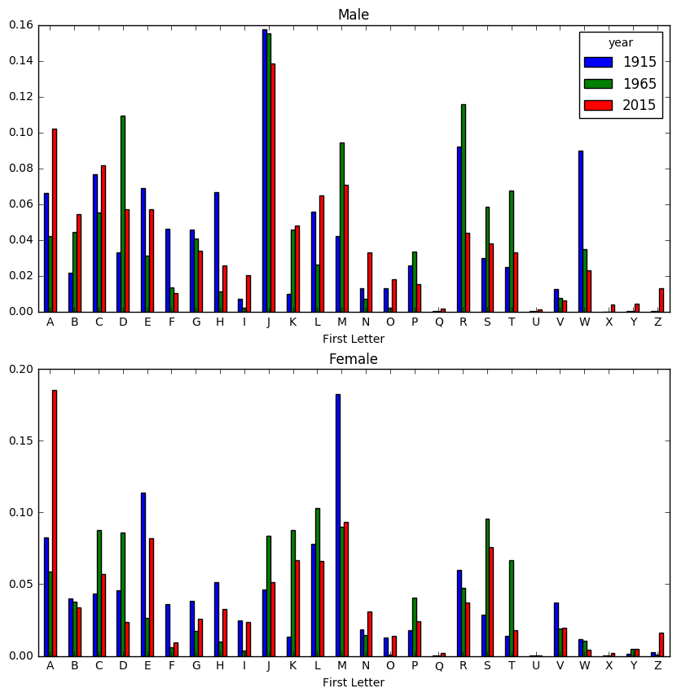

```python
import pandas as pd

# Assemble all of the data into one file
years = range(1880, 2016)
pieces = []
columns = ['name', 'sex', 'births']
for year in years:
    path = 'BabyNames Data/yob%d.txt' % year
    frame = pd.read_csv(path, names = columns)
    
    frame['year'] = year
    pieces.append(frame)
    names = pd.concat(pieces, ignore_index = True)
    # the concat glues the DataFrame objects together row-wise by default

names.head(10)
```


<div>
<table border="1" class="dataframe">
  <thead>
    <tr style="text-align: right;">
      <th></th>
      <th>name</th>
      <th>sex</th>
      <th>births</th>
      <th>year</th>
    </tr>
  </thead>
  <tbody>
    <tr>
      <th>0</th>
      <td>Mary</td>
      <td>F</td>
      <td>7065</td>
      <td>1880</td>
    </tr>
    <tr>
      <th>1</th>
      <td>Anna</td>
      <td>F</td>
      <td>2604</td>
      <td>1880</td>
    </tr>
    <tr>
      <th>2</th>
      <td>Emma</td>
      <td>F</td>
      <td>2003</td>
      <td>1880</td>
    </tr>
    <tr>
      <th>3</th>
      <td>Elizabeth</td>
      <td>F</td>
      <td>1939</td>
      <td>1880</td>
    </tr>
    <tr>
      <th>4</th>
      <td>Minnie</td>
      <td>F</td>
      <td>1746</td>
      <td>1880</td>
    </tr>
    <tr>
      <th>5</th>
      <td>Margaret</td>
      <td>F</td>
      <td>1578</td>
      <td>1880</td>
    </tr>
    <tr>
      <th>6</th>
      <td>Ida</td>
      <td>F</td>
      <td>1472</td>
      <td>1880</td>
    </tr>
    <tr>
      <th>7</th>
      <td>Alice</td>
      <td>F</td>
      <td>1414</td>
      <td>1880</td>
    </tr>
    <tr>
      <th>8</th>
      <td>Bertha</td>
      <td>F</td>
      <td>1320</td>
      <td>1880</td>
    </tr>
    <tr>
      <th>9</th>
      <td>Sarah</td>
      <td>F</td>
      <td>1288</td>
      <td>1880</td>
    </tr>
  </tbody>
</table>
</div>


```python
# Aggregate data at year and sex level using pivot_table
total_births = names.pivot_table(values = 'births', index = 'year', columns = 'sex', aggfunc = sum) # total_births is a dataframe
total_births.tail()
```


<div>
<table border="1" class="dataframe">
  <thead>
    <tr style="text-align: right;">
      <th>sex</th>
      <th>F</th>
      <th>M</th>
    </tr>
    <tr>
      <th>year</th>
      <th></th>
      <th></th>
    </tr>
  </thead>
  <tbody>
    <tr>
      <th>2011</th>
      <td>1754424</td>
      <td>1894262</td>
    </tr>
    <tr>
      <th>2012</th>
      <td>1755254</td>
      <td>1890889</td>
    </tr>
    <tr>
      <th>2013</th>
      <td>1747544</td>
      <td>1883945</td>
    </tr>
    <tr>
      <th>2014</th>
      <td>1777242</td>
      <td>1910876</td>
    </tr>
    <tr>
      <th>2015</th>
      <td>1769325</td>
      <td>1898858</td>
    </tr>
  </tbody>
</table>
</div>


```python
# Aggregate data at year and sex level using gorupby
total_birth2 = names.groupby(by = ['sex', 'year']).births.sum() # total_birth2 is a serie 
total_birth2[-5:]
```


    sex  year
    M    2011    1894262
         2012    1890889
         2013    1883945
         2014    1910876
         2015    1898858
    Name: births, dtype: int64


```python
import matplotlib.pyplot as plt

total_births.plot(title = "Total Births by sex and year")
plt.show()
```


```python
# Proportion of Name
def add_prop(group):
    #Integer division floors
    births = group.births.astype(float)
    
    group['prop'] = births/births.sum()
    return group
names = names.groupby(['year', 'sex']).apply(add_prop)
names.head()
```


<div>
<table border="1" class="dataframe">
  <thead>
    <tr style="text-align: right;">
      <th></th>
      <th>name</th>
      <th>sex</th>
      <th>births</th>
      <th>year</th>
      <th>prop</th>
    </tr>
  </thead>
  <tbody>
    <tr>
      <th>0</th>
      <td>Mary</td>
      <td>F</td>
      <td>7065</td>
      <td>1880</td>
      <td>0.077644</td>
    </tr>
    <tr>
      <th>1</th>
      <td>Anna</td>
      <td>F</td>
      <td>2604</td>
      <td>1880</td>
      <td>0.028618</td>
    </tr>
    <tr>
      <th>2</th>
      <td>Emma</td>
      <td>F</td>
      <td>2003</td>
      <td>1880</td>
      <td>0.022013</td>
    </tr>
    <tr>
      <th>3</th>
      <td>Elizabeth</td>
      <td>F</td>
      <td>1939</td>
      <td>1880</td>
      <td>0.021310</td>
    </tr>
    <tr>
      <th>4</th>
      <td>Minnie</td>
      <td>F</td>
      <td>1746</td>
      <td>1880</td>
      <td>0.019189</td>
    </tr>
  </tbody>
</table>
</div>


```python
# Sanity check if prop column adds up to 1/close to 1
import numpy as np
np.allclose(names.groupby(['year','sex']).prop.sum(), 1)
```


    True


```python
# Top 1000 names for each sex/year combination 
def get_top1000(group):
    return group.sort_values(by = 'births', ascending = False)[:1000]

grouped = names.groupby(['year','sex'])
top1000 = grouped.apply(get_top1000)
top1000.head()
```


<div>
<table border="1" class="dataframe">
  <thead>
    <tr style="text-align: right;">
      <th></th>
      <th></th>
      <th></th>
      <th>name</th>
      <th>sex</th>
      <th>births</th>
      <th>year</th>
      <th>prop</th>
    </tr>
    <tr>
      <th>year</th>
      <th>sex</th>
      <th></th>
      <th></th>
      <th></th>
      <th></th>
      <th></th>
      <th></th>
    </tr>
  </thead>
  <tbody>
    <tr>
      <th rowspan="5" valign="top">1880</th>
      <th rowspan="5" valign="top">F</th>
      <th>0</th>
      <td>Mary</td>
      <td>F</td>
      <td>7065</td>
      <td>1880</td>
      <td>0.077644</td>
    </tr>
    <tr>
      <th>1</th>
      <td>Anna</td>
      <td>F</td>
      <td>2604</td>
      <td>1880</td>
      <td>0.028618</td>
    </tr>
    <tr>
      <th>2</th>
      <td>Emma</td>
      <td>F</td>
      <td>2003</td>
      <td>1880</td>
      <td>0.022013</td>
    </tr>
    <tr>
      <th>3</th>
      <td>Elizabeth</td>
      <td>F</td>
      <td>1939</td>
      <td>1880</td>
      <td>0.021310</td>
    </tr>
    <tr>
      <th>4</th>
      <td>Minnie</td>
      <td>F</td>
      <td>1746</td>
      <td>1880</td>
      <td>0.019189</td>
    </tr>
  </tbody>
</table>
</div>


```python
# Analyzing the name trend
boys = top1000[top1000.sex == 'M']
girls = top1000[top1000.sex == 'F']

total_births = top1000.pivot_table(values = 'births', index = 'year', columns = 'name', aggfunc = sum)
total_births.head()
```


<div>
<table border="1" class="dataframe">
  <thead>
    <tr style="text-align: right;">
      <th>name</th>
      <th>Aaden</th>
      <th>Aaliyah</th>
      <th>Aanya</th>
      <th>Aarav</th>
      <th>Aaron</th>
      <th>Aarush</th>
      <th>Ab</th>
      <th>Abagail</th>
      <th>Abb</th>
      <th>Abbey</th>
      <th>...</th>
      <th>Zoa</th>
      <th>Zoe</th>
      <th>Zoey</th>
      <th>Zoie</th>
      <th>Zola</th>
      <th>Zollie</th>
      <th>Zona</th>
      <th>Zora</th>
      <th>Zula</th>
      <th>Zuri</th>
    </tr>
    <tr>
      <th>year</th>
      <th></th>
      <th></th>
      <th></th>
      <th></th>
      <th></th>
      <th></th>
      <th></th>
      <th></th>
      <th></th>
      <th></th>
      <th></th>
      <th></th>
      <th></th>
      <th></th>
      <th></th>
      <th></th>
      <th></th>
      <th></th>
      <th></th>
      <th></th>
      <th></th>
    </tr>
  </thead>
  <tbody>
    <tr>
      <th>1880</th>
      <td>NaN</td>
      <td>NaN</td>
      <td>NaN</td>
      <td>NaN</td>
      <td>102.0</td>
      <td>NaN</td>
      <td>NaN</td>
      <td>NaN</td>
      <td>NaN</td>
      <td>NaN</td>
      <td>...</td>
      <td>8.0</td>
      <td>23.0</td>
      <td>NaN</td>
      <td>NaN</td>
      <td>7.0</td>
      <td>NaN</td>
      <td>8.0</td>
      <td>28.0</td>
      <td>27.0</td>
      <td>NaN</td>
    </tr>
    <tr>
      <th>1881</th>
      <td>NaN</td>
      <td>NaN</td>
      <td>NaN</td>
      <td>NaN</td>
      <td>94.0</td>
      <td>NaN</td>
      <td>NaN</td>
      <td>NaN</td>
      <td>NaN</td>
      <td>NaN</td>
      <td>...</td>
      <td>NaN</td>
      <td>22.0</td>
      <td>NaN</td>
      <td>NaN</td>
      <td>10.0</td>
      <td>NaN</td>
      <td>9.0</td>
      <td>21.0</td>
      <td>27.0</td>
      <td>NaN</td>
    </tr>
    <tr>
      <th>1882</th>
      <td>NaN</td>
      <td>NaN</td>
      <td>NaN</td>
      <td>NaN</td>
      <td>85.0</td>
      <td>NaN</td>
      <td>NaN</td>
      <td>NaN</td>
      <td>NaN</td>
      <td>NaN</td>
      <td>...</td>
      <td>8.0</td>
      <td>25.0</td>
      <td>NaN</td>
      <td>NaN</td>
      <td>9.0</td>
      <td>NaN</td>
      <td>17.0</td>
      <td>32.0</td>
      <td>21.0</td>
      <td>NaN</td>
    </tr>
    <tr>
      <th>1883</th>
      <td>NaN</td>
      <td>NaN</td>
      <td>NaN</td>
      <td>NaN</td>
      <td>105.0</td>
      <td>NaN</td>
      <td>NaN</td>
      <td>NaN</td>
      <td>NaN</td>
      <td>NaN</td>
      <td>...</td>
      <td>NaN</td>
      <td>23.0</td>
      <td>NaN</td>
      <td>NaN</td>
      <td>10.0</td>
      <td>NaN</td>
      <td>11.0</td>
      <td>35.0</td>
      <td>25.0</td>
      <td>NaN</td>
    </tr>
    <tr>
      <th>1884</th>
      <td>NaN</td>
      <td>NaN</td>
      <td>NaN</td>
      <td>NaN</td>
      <td>97.0</td>
      <td>NaN</td>
      <td>NaN</td>
      <td>NaN</td>
      <td>NaN</td>
      <td>NaN</td>
      <td>...</td>
      <td>13.0</td>
      <td>31.0</td>
      <td>NaN</td>
      <td>NaN</td>
      <td>14.0</td>
      <td>6.0</td>
      <td>8.0</td>
      <td>58.0</td>
      <td>27.0</td>
      <td>NaN</td>
    </tr>
  </tbody>
</table>
<p>5 rows × 7062 columns</p>
</div>


```python
subset = total_births[['James','Will','Jasper', 'Robert']]
subset.plot(subplots = True, figsize= (12,10), grid = False, title = 'Number of births per year')
plt.show()
```


```python
subset.plot(title = 'Number of births per year')
plt.show()
# A totally different story the previous chart
```


```python
# Hypothesis: there are fewer parents are choosing common names for their children.
# Metric1 : the sum of proportion in the top1000 names
table = top1000.pivot_table(values = 'prop', index = 'year', columns = 'sex', aggfunc = sum)
table.plot(title = 'Sum of Top1000 Names Portion', yticks = np.linspace(0, 1.2, 13), xticks = range(1880, 2020, 10))
plt.show()
# the decreasing total proportion in the top1000 indicates that there is an increase in name diversity. 
```


```python
# Metric2 : the number of distinct names
df = boys[boys.year == 2015]
prop_cumsum = df.sort_values(by = 'prop', ascending = False).prop.cumsum()
prop_cumsum.head()
```


    year  sex         
    2015  M    1844730    0.010275
               1844731    0.019902
               1844732    0.028610
               1844733    0.036940
               1844734    0.045265
    Name: prop, dtype: float64


```python
prop_cumsum.searchsorted(0.5) # Find indices where elements should be inserted to maintain order.
# 0.5 occurs in between 133 and 134, that shows the proportion of the frequency of first 134 names accounted for 50% of total baby counts. 
```


    array([134], dtype=int64)


```python
# We can apply this to each year by writing a function
def get_quantile_count(group, q=0.5):
    group = group.sort_values(by = 'prop', ascending = False)
    pos = group.prop.cumsum().searchsorted(q)
    return pos[0] + 1

diversity = top1000.groupby(['year', 'sex']).apply(get_quantile_count)
diversity = diversity.unstack('sex')
diversity.head()
```


<div>
<table border="1" class="dataframe">
  <thead>
    <tr style="text-align: right;">
      <th>sex</th>
      <th>F</th>
      <th>M</th>
    </tr>
    <tr>
      <th>year</th>
      <th></th>
      <th></th>
    </tr>
  </thead>
  <tbody>
    <tr>
      <th>1880</th>
      <td>38</td>
      <td>14</td>
    </tr>
    <tr>
      <th>1881</th>
      <td>38</td>
      <td>14</td>
    </tr>
    <tr>
      <th>1882</th>
      <td>38</td>
      <td>15</td>
    </tr>
    <tr>
      <th>1883</th>
      <td>39</td>
      <td>15</td>
    </tr>
    <tr>
      <th>1884</th>
      <td>39</td>
      <td>16</td>
    </tr>
  </tbody>
</table>
</div>


```python
diversity.plot(title = "Number of popular names in top 50%")
plt.show()
# Diverse Definition: among top 1000 names for boys and girls, we want to know the proportion of each name, 
# if the proporation for each name is relatively lower then we conclude the numbers of each distinct name are more spread out, 
# which indicates higher diversity.

# Findings: Girl names has always been more diverse than boy names, and they have only become more so over time. 
```


```python
# The last letter revolution 
# 1. extract the last letter from the name column
get_last_letter = lambda x: x[0]
last_letter = names.name.map(get_last_letter)
# Difference between map and apply: 
# Apply can make a DataFrame out of a series; however, map will just put a series in every cell of another series.
last_letter.name = 'First Letter'
table = names.pivot_table(values = 'births', index = last_letter, columns = ['sex', 'year'], aggfunc = sum)
subtable = table.reindex(columns = [1915, 1965, 2015], level = 'year')
subtable.head()
```


<div>
<table border="1" class="dataframe">
  <thead>
    <tr>
      <th>sex</th>
      <th colspan="3" halign="left">F</th>
      <th colspan="3" halign="left">M</th>
    </tr>
    <tr>
      <th>year</th>
      <th>1915</th>
      <th>1965</th>
      <th>2015</th>
      <th>1915</th>
      <th>1965</th>
      <th>2015</th>
    </tr>
    <tr>
      <th>First Letter</th>
      <th></th>
      <th></th>
      <th></th>
      <th></th>
      <th></th>
      <th></th>
    </tr>
  </thead>
  <tbody>
    <tr>
      <th>A</th>
      <td>81162.0</td>
      <td>103678.0</td>
      <td>328139.0</td>
      <td>56056.0</td>
      <td>78537.0</td>
      <td>193644.0</td>
    </tr>
    <tr>
      <th>B</th>
      <td>39306.0</td>
      <td>66997.0</td>
      <td>59874.0</td>
      <td>18287.0</td>
      <td>82693.0</td>
      <td>103384.0</td>
    </tr>
    <tr>
      <th>C</th>
      <td>42681.0</td>
      <td>154431.0</td>
      <td>101421.0</td>
      <td>65201.0</td>
      <td>102732.0</td>
      <td>155122.0</td>
    </tr>
    <tr>
      <th>D</th>
      <td>45213.0</td>
      <td>152305.0</td>
      <td>41361.0</td>
      <td>27951.0</td>
      <td>203874.0</td>
      <td>108107.0</td>
    </tr>
    <tr>
      <th>E</th>
      <td>111794.0</td>
      <td>46556.0</td>
      <td>144784.0</td>
      <td>58626.0</td>
      <td>58422.0</td>
      <td>108528.0</td>
    </tr>
  </tbody>
</table>
</div>


```python
# Scale/Normalize the table by calculating proportion
subtable.sum()
letter_prop = subtable/subtable.sum().astype(float)
letter_prop.head()
```


<div>
<table border="1" class="dataframe">
  <thead>
    <tr>
      <th>sex</th>
      <th colspan="3" halign="left">F</th>
      <th colspan="3" halign="left">M</th>
    </tr>
    <tr>
      <th>year</th>
      <th>1915</th>
      <th>1965</th>
      <th>2015</th>
      <th>1915</th>
      <th>1965</th>
      <th>2015</th>
    </tr>
    <tr>
      <th>First Letter</th>
      <th></th>
      <th></th>
      <th></th>
      <th></th>
      <th></th>
      <th></th>
    </tr>
  </thead>
  <tbody>
    <tr>
      <th>A</th>
      <td>0.082492</td>
      <td>0.058739</td>
      <td>0.185460</td>
      <td>0.066057</td>
      <td>0.042193</td>
      <td>0.101979</td>
    </tr>
    <tr>
      <th>B</th>
      <td>0.039950</td>
      <td>0.037957</td>
      <td>0.033840</td>
      <td>0.021550</td>
      <td>0.044426</td>
      <td>0.054445</td>
    </tr>
    <tr>
      <th>C</th>
      <td>0.043380</td>
      <td>0.087493</td>
      <td>0.057322</td>
      <td>0.076833</td>
      <td>0.055191</td>
      <td>0.081692</td>
    </tr>
    <tr>
      <th>D</th>
      <td>0.045954</td>
      <td>0.086289</td>
      <td>0.023377</td>
      <td>0.032938</td>
      <td>0.109529</td>
      <td>0.056933</td>
    </tr>
    <tr>
      <th>E</th>
      <td>0.113626</td>
      <td>0.026376</td>
      <td>0.081830</td>
      <td>0.069085</td>
      <td>0.031386</td>
      <td>0.057154</td>
    </tr>
  </tbody>
</table>
</div>


```python
import matplotlib.pyplot as plt
fig, axes = plt.subplots(2,1,figsize = (10,10))
letter_prop['M'].plot(kind = 'bar', rot = 0, ax = axes[0], title = 'Male')
letter_prop['F'].plot(kind = 'bar', rot = 0, ax = axes[1], title = 'Female', legend = False)
plt.show()
```





```python
# Make each letter a time series:
letter_prop = table/table.sum().astype(float)
# picking girl names start with A, M and E and transpose the dataframe to be mroe readable
AME_ts = letter_prop.ix[:5,['F']].T
AME_ts.head()
AME_ts.plot()
plt.show()
```


```python
AME_ts = pd.DataFrame(AME_ts)
#df.drop('reports', axis=1)
AME_ts.head()
```


<div>
<table border="1" class="dataframe">
  <thead>
    <tr style="text-align: right;">
      <th></th>
      <th>First Letter</th>
      <th>A</th>
      <th>B</th>
      <th>C</th>
      <th>D</th>
      <th>E</th>
    </tr>
    <tr>
      <th>sex</th>
      <th>year</th>
      <th></th>
      <th></th>
      <th></th>
      <th></th>
      <th></th>
    </tr>
  </thead>
  <tbody>
    <tr>
      <th rowspan="5" valign="top">F</th>
      <th>1880</th>
      <td>0.102580</td>
      <td>0.042597</td>
      <td>0.064489</td>
      <td>0.024376</td>
      <td>0.125769</td>
    </tr>
    <tr>
      <th>1881</th>
      <td>0.102281</td>
      <td>0.043642</td>
      <td>0.061553</td>
      <td>0.025002</td>
      <td>0.127696</td>
    </tr>
    <tr>
      <th>1882</th>
      <td>0.102005</td>
      <td>0.044730</td>
      <td>0.059843</td>
      <td>0.023709</td>
      <td>0.127680</td>
    </tr>
    <tr>
      <th>1883</th>
      <td>0.103563</td>
      <td>0.046244</td>
      <td>0.061050</td>
      <td>0.024119</td>
      <td>0.128644</td>
    </tr>
    <tr>
      <th>1884</th>
      <td>0.103271</td>
      <td>0.046543</td>
      <td>0.061378</td>
      <td>0.023710</td>
      <td>0.127616</td>
    </tr>
  </tbody>
</table>
</div>


```python
# How to drop a level of multiindex. 
AME_ts.index = AME_ts.index.droplevel(0)
# Or Alternatively: AME_ts.reset_index(level=0, drop=True)
```


```python
# Now it looks much better! 
AME_ts.head()
AME_ts.plot()
plt.show()
```


```python
# Another Fun trend is looking at names that changed sexes in popularity
# Example: Leslie or Lesley

all_names = top1000.name.unique()
mask = np.array(['lesl' in x.lower() for x in all_names])
lesley_like = all_names[mask]
lesley_like # extract all the name that is like lesley

filtered = top1000[top1000.name.isin(lesley_like)]
filtered.groupby('name').births.sum()
```


    name
    Leslee       993
    Lesley     35032
    Lesli        929
    Leslie    376034
    Lesly      11431
    Name: births, dtype: int64


```python
# Normalize the within year
table = filtered.pivot_table(values = 'births', index = 'year', columns = 'sex', aggfunc = sum)
table.head()
#table.sum(1).head()
```


<div>
<table border="1" class="dataframe">
  <thead>
    <tr style="text-align: right;">
      <th>sex</th>
      <th>F</th>
      <th>M</th>
    </tr>
    <tr>
      <th>year</th>
      <th></th>
      <th></th>
    </tr>
  </thead>
  <tbody>
    <tr>
      <th>1880</th>
      <td>8.0</td>
      <td>79.0</td>
    </tr>
    <tr>
      <th>1881</th>
      <td>11.0</td>
      <td>92.0</td>
    </tr>
    <tr>
      <th>1882</th>
      <td>9.0</td>
      <td>128.0</td>
    </tr>
    <tr>
      <th>1883</th>
      <td>7.0</td>
      <td>125.0</td>
    </tr>
    <tr>
      <th>1884</th>
      <td>15.0</td>
      <td>125.0</td>
    </tr>
  </tbody>
</table>
</div>


```python
table = table.div(table.sum(1), axis = 0) # DaraFrame.div() is: Floating division of dataframe and other, element-wise (binary operator truediv).
table.tail()
```


<div>
<table border="1" class="dataframe">
  <thead>
    <tr style="text-align: right;">
      <th>sex</th>
      <th>F</th>
      <th>M</th>
    </tr>
    <tr>
      <th>year</th>
      <th></th>
      <th></th>
    </tr>
  </thead>
  <tbody>
    <tr>
      <th>2011</th>
      <td>1.0</td>
      <td>NaN</td>
    </tr>
    <tr>
      <th>2012</th>
      <td>1.0</td>
      <td>NaN</td>
    </tr>
    <tr>
      <th>2013</th>
      <td>1.0</td>
      <td>NaN</td>
    </tr>
    <tr>
      <th>2014</th>
      <td>1.0</td>
      <td>NaN</td>
    </tr>
    <tr>
      <th>2015</th>
      <td>1.0</td>
      <td>NaN</td>
    </tr>
  </tbody>
</table>
</div>


```python
table.plot(style = {'M':'k-', 'F': 'k--'})
plt.show()
# proportion of male/female Lesley-like names over time
```


